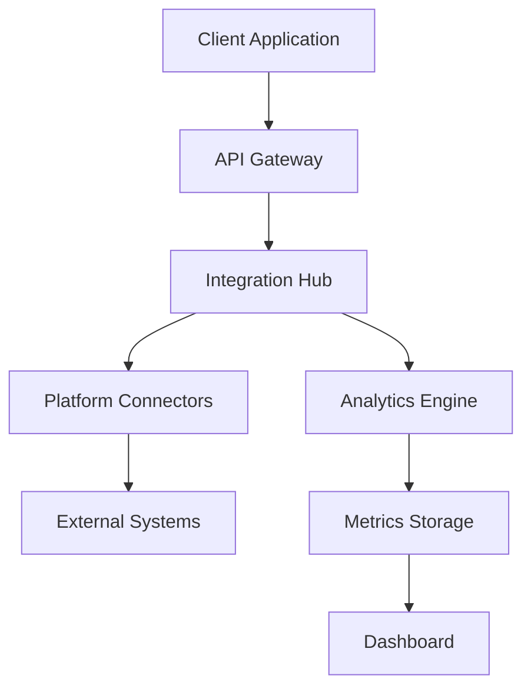

# cxentral Technical Documentation Suite

## Platform Architecture

### Core Components
1. Integration Hub
   - Real-time data synchronization
   - Multi-platform connectivity
   - Custom workflow engine
   - Error handling and recovery

2. Analytics Engine
   - Stream processing
   - Real-time metrics
   - Predictive modeling
   - Custom dashboards

3. Security Framework
   - OAuth 2.0 authentication
   - End-to-end encryption
   - Role-based access control
   - Audit logging

### Integration Points

```typescript
// Example Integration Configuration
interface IntegrationConfig {
  platform: {
    type: 'verint' | 'genesys' | 'salesforce';
    version: string;
    environment: 'production' | 'staging';
  };
  
  authentication: {
    method: 'oauth2' | 'jwt' | 'api-key';
    credentials: {
      clientId: string;
      clientSecret: string;
      scopes: string[];
    };
  };
  
  dataSync: {
    mode: 'real-time' | 'batch';
    frequency?: number;
    mapping: Record<string, string>;
  };
}

// Implementation Example
const verintIntegration = new Integration({
  platform: {
    type: 'verint',
    version: '15.2',
    environment: 'production'
  },
  authentication: {
    method: 'oauth2',
    credentials: {
      clientId: process.env.VERINT_CLIENT_ID,
      clientSecret: process.env.VERINT_CLIENT_SECRET,
      scopes: ['read', 'write']
    }
  },
  dataSync: {
    mode: 'real-time',
    mapping: {
      'customer.id': 'verint_customer_id',
      'interaction.type': 'interaction_type'
    }
  }
});
```

### Data Flow Architecture



### Security Implementation

```typescript
// Security Configuration
interface SecurityConfig {
  encryption: {
    algorithm: 'AES-256-GCM';
    keyRotation: number; // days
  };
  
  authentication: {
    sessionTimeout: number;
    mfaRequired: boolean;
    passwordPolicy: {
      minLength: number;
      requireSpecialChars: boolean;
      requireNumbers: boolean;
    };
  };
  
  audit: {
    enabled: boolean;
    retention: number; // days
    events: string[];
  };
}
```

## API Documentation

### REST Endpoints

#### Authentication
```http
POST /api/v1/auth/token
Content-Type: application/json

{
  "grant_type": "client_credentials",
  "client_id": "your_client_id",
  "client_secret": "your_client_secret"
}
```

#### Integration Management
```http
POST /api/v1/integrations
Content-Type: application/json
Authorization: Bearer <token>

{
  "platform": "verint",
  "config": {
    "endpoint": "https://api.verint.com",
    "credentials": {
      "clientId": "client_id",
      "clientSecret": "client_secret"
    }
  }
}
```

### WebSocket Events

```typescript
// Real-time Updates
interface WebSocketMessage {
  type: 'update' | 'error' | 'heartbeat';
  payload: {
    source: string;
    data: any;
    timestamp: string;
  };
}

// Example Usage
const ws = new WebSocket('wss://api.cxentral.com/v1/events');
ws.onmessage = (event) => {
  const message: WebSocketMessage = JSON.parse(event.data);
  handleMessage(message);
};
```

## Implementation Guides

### Platform Integration

1. Authentication Setup
```typescript
const auth = new Authentication({
  type: 'oauth2',
  config: {
    clientId: process.env.CLIENT_ID,
    clientSecret: process.env.CLIENT_SECRET,
    scopes: ['read', 'write']
  }
});

const token = await auth.getToken();
```

2. Data Synchronization
```typescript
const sync = new DataSync({
  source: 'verint',
  target: 'cxentral',
  mapping: {
    'customer.id': 'verint_customer_id',
    'interaction.type': 'interaction_type'
  }
});

await sync.start();
```

3. Event Handling
```typescript
const eventHandler = new EventHandler({
  types: ['customer.created', 'interaction.updated'],
  callback: async (event) => {
    await processEvent(event);
  }
});

eventHandler.listen();
```

### Error Handling

```typescript
class ErrorHandler {
  async handle(error: ApiError) {
    switch (error.code) {
      case 'RATE_LIMIT':
        await this.handleRateLimit(error);
        break;
      case 'AUTH_ERROR':
        await this.refreshToken();
        break;
      default:
        await this.logError(error);
    }
  }

  private async handleRateLimit(error: ApiError) {
    const delay = error.reset - Date.now();
    await sleep(delay);
    return this.retryRequest(error.request);
  }
}
```

## Performance Optimization

### Caching Strategy
```typescript
interface CacheConfig {
  storage: 'redis' | 'memory';
  ttl: number;
  maxSize: number;
}

class CacheManager {
  async get(key: string): Promise<any> {
    const cached = await this.cache.get(key);
    if (cached) {
      return JSON.parse(cached);
    }
    const data = await this.fetchFresh(key);
    await this.cache.set(key, JSON.stringify(data), 'EX', this.ttl);
    return data;
  }
}
```

### Load Balancing
```typescript
interface LoadBalancerConfig {
  strategy: 'round-robin' | 'least-connections';
  healthCheck: {
    interval: number;
    timeout: number;
    unhealthyThreshold: number;
  };
}
```

## Monitoring and Analytics

### Metrics Collection
```typescript
interface MetricsConfig {
  collection: {
    interval: number;
    metrics: string[];
  };
  storage: {
    type: 'timeseries' | 'document';
    retention: number;
  };
  alerts: {
    thresholds: Record<string, number>;
    channels: string[];
  };
}
```

### Health Checks
```typescript
interface HealthCheck {
  service: string;
  endpoint: string;
  interval: number;
  timeout: number;
  successThreshold: number;
  failureThreshold: number;
}
```